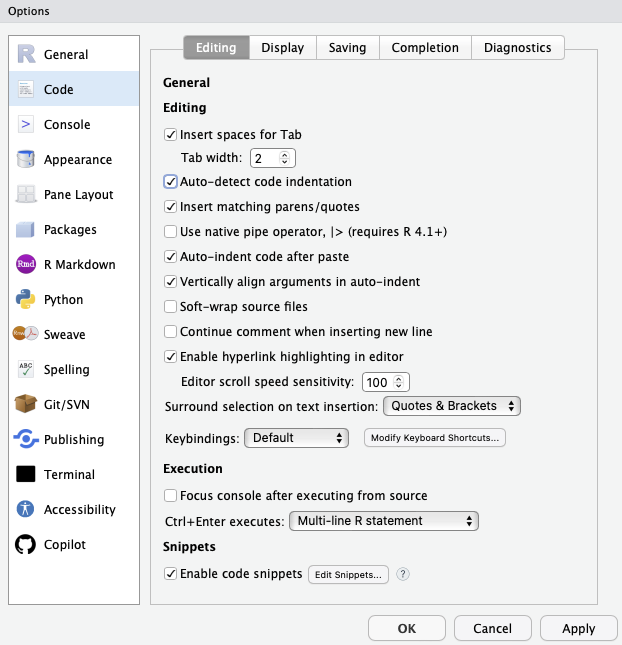

Welcome to **PHW251B**! The purpose of this module is to help you get your `RStudio` environment set up on `Datahub` and also some tips and tricks regarding how to leverage the tools from the `knitr` packages for rendering/knitting your outputs. 


---

# Intro to DataHub

The R related materials for **PHW251B** are hosted on the `DataHub` which is an open-source, cloud-based computing platform that lets you run RStudio right in your web browser. A benefit of using `DataHub` is that you and your fellow student colleagues are going to have access to the same computational resources, regardless of any differences in local machines/computers. Additionally, the `Rmarkdown` files for modules, exercises, assignments, and data are located in the `week_*` folders. Furthermore, we already pre-installed each of the open source libraries/packages into the **PHW251B** instance of `DataHub` so you already have the tools that you need for the course at your disposal. 

--- 

# Setting the Working Directory

Each module, exercise, and assignment is going to be rooted relative to the `week_*` folder for that week. 

## Hardcoding

```{r}
# setwd("~/Berkeley/Lecturer/uc-berkeley-data-viz/week_1")

# 1) Activate the repo root as the current project (edit the path if needed)
usethis::proj_activate("~/PHW251B")

# 2) Create the RStudio project file in that folder
usethis::use_rstudio()          # creates PHW251B.Rproj at PHW251B/

# 3) Add sensible git ignores for RStudio cruft
usethis::git_vaccinate()
```

## From Files Pane

In the files Pane, -> click More

---


---

# Intro to knitr for Rendering/Knitting

## Global vs Local Chunk Settings

First, we are going to set the **Global Settings** for your Markdown file using `knitr`. `knitr` is the engine that executes your R code chunks and weaves the code, outputs, and narrative into a single document (HTML, PDF, Word, or Quarto). It runs chunks in order, captures results (figures, tables, printed output), and applies these options to every code chunk. The way to override these **Global Settings** is to apply **Local Settings** within the code chunk itself. For instance, you are going to notice that the following code chunk has the **Global Settings** `knitr::opts_chunk$set(echo = TRUE, tidy = TRUE, tidy.opts = list(width.cutoff = 85))` in the code and the **Local Settings** `echo = FALSE, warning=FALSE, message=FALSE` in the chunk's definition. This is because the **Global Settings** do not apply to the very first code chunk! Also, a **Local Settings** is going to override the **Global Settings**.

## Best Practice Note

As a best practice, DO NOT attach knitr with `library(knitr)`; instead, call it via the namespace, e.g., `knitr::opts_chunk$set(...)` in your setup. Namespacing keeps your search path clean, avoids masking/conflicts, and makes your document more reproducible by explicitly signaling which package provides a function.

### Different Global and Local Chunks

- `echo = TRUE` — show the code in the rendered document
- `echo = FALSE` — do NOT show the code in the rendered document
- `warning = FALSE` — run code but suppress warnings in the output
- `warning = TRUE` — run code and show warnings in the output
- `message = FALSE` — suppress messages (e.g., package startup notes)
- `message = TRUE` — show messages (e.g., package startup notes)
- `tidy = TRUE` — pretty-print displayed code (when echo=TRUE) using formatR if available; respects tidy.opts (e.g., width.cutoff). Affects formatting in the rendered document only, not execution
- `tidy = FALSE` — show code exactly as written; ignores tidy.opts
- `tidy.opts` - list(width.cutoff = 85) — pass options to formatR; here, wrap long lines at ~85 characters
- `fig.align` -  alignment of plot ("left", "center", "right")
- `fig.width` - figure width in inches
- `fig.height` - figure height in inches

### Global Settings for this Module

```{r setup, echo = FALSE, warning=FALSE, message=FALSE, tidy=TRUE}
knitr::opts_chunk$set(echo = TRUE, tidy = TRUE, message = TRUE, warning = TRUE, tidy.opts = list(width.cutoff = 85))


setwd("~/Berkeley/Lecturer/uc-berkeley-data-viz/week_1")

library(readr)
asthma = read_csv("data/asthma.csv")


```

---

### Examples

#### Displaying code and/or output

##### Global echo=TRUE in action 

This is how you should be rendering your assignments with the code & and output being shown!

```{r}
# Code is shown (echo=TRUE globally), and output is shown
summary(cars)
```

##### Local override -> hide code, show only output

```{r, echo=FALSE}
paste0("The code is hidden and the output still appears because echo=FALSE")
```

##### Local override -> show code but hide results

```{r, results='hide'}
paste0("The code is shown and the output is hidden because results='hide'")
```

##### Local override -> do NOT evaluate (show code only)

```{r, eval=FALSE}
paste0("This text does not appear because this chunk is not evaluated when rendering since eval='FALSE'")
```

#### Messages

##### With default global settings

```{r}
message("The message is displayed in the output because the global default is set to message=FALSE")
"Finished"
```

##### With local override -> do NOT display message

Sometimes the messages are not that informative and may distract from what you are trying to convey to your audience. In instances, like these it is best practice to suppress the message. 

```{r, message=FALSE}
message("The message is suppressed in the output because the local chunk setting is set to message=FALSE")
"Finished"
```

#### Warnings

##### With default global settings

```{r}
sqrt(-1)   # produces NaN with a warning
paste0("Warning message is displayed because of global default warning=TRUE")
```

##### Local override -> do NOT display warning message

```{r, warning=FALSE}
sqrt(-1)   # produces NaN with a warning
paste0("Warning message is suppressed because of local chunk setting warning=FALSE")
```

#### Figures 

global vs local figure options

Global defaults (from setup): fig.align='center', out.width='70%'.

```{r}
plot(AirPassengers, main = "Global fig options (70% width, centered)")
```


```{r, out.width = '90%'}
plot(AirPassengers, main = "Global fig options (90% width, centered)")
```

---

# RStudio Setup with Global Options 

**Global Options** are `RStudio’s` application-wide preferences—the settings that control how `RStudio` looks and behaves across all projects and sessions in your environment such as `DataHub`. From here you configure things like the editor’s appearance (font, theme), code editing behavior (indentation, function highlighting, rainbow parentheses), and more. These choices persist between sessions and apply by default to any project you open. This part of the module is going to guide you on how to set up your environment with features that are going to enhance your learning and coding ability.

To access your **Global Options** click **Tools** at the top of your RStudio environment -> click **Global Options**.

## Code

In the left sidebar, click **Code**

### Editing

Then click **Editing** tab at the top In the **General** section, select these options
  - Insert spaces for Tab (2 spaces is standard for the number of spaces a tab creates)  
  - Auto-detect code indentation
  - Insert matching parentheses/quotes
  - Vertically align arguments in auto-indent

Here is how your **Editing** tab should look like after completing these steps

```{r editing image}
knitr::include_graphics(here::here("images", "week_1", "01_code-editing.png"))
```

### Display

Remain in the **Code** pane and click on the **Display** tab 

#### General

In the **General** section

Select these options
  - Highlight selected word
  - Show line numbers
  - Show margin and set Margin column to 80
  - Highlight selected word
  - Highlight R function calls (syntax emphasis for function names)
  - Blinking cursor
  - Allow drag and drop of text 

### Display

In the section titled **Display**, select the following 
  - Highlight R function calls
  - Enable preview of names and hexadecimal colors
  - Use rainbow parentheses
  
Here is how your **Display** tab should look like after completing these steps

```{r display image}
knitr::include_graphics(here::here("images", "week_1", "01_code-display.png"))
```


## Appearance

In the left sidebar, click **Appearance**

Set
  - Editor font: choose a font you like 
  - Editor font size: pick a comfortable size for your code
  - Help panel font size: pick a comfortable size for the warning & error messages
  - Editor theme: choose a light or dark theme you prefer 
  
Here is how your **Editing** tab should look like after completing these steps

```{r appearance image}
knitr::include_graphics(here::here("images", "week_1", "01_appearance.png"))
```  

Click OK (or Apply then OK) to save all changes.
if any appearance changes don’t immediately take effect.Restart your RStudio session 

